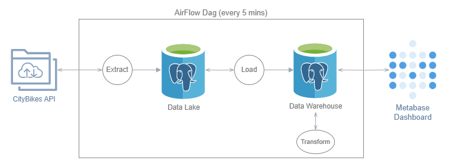
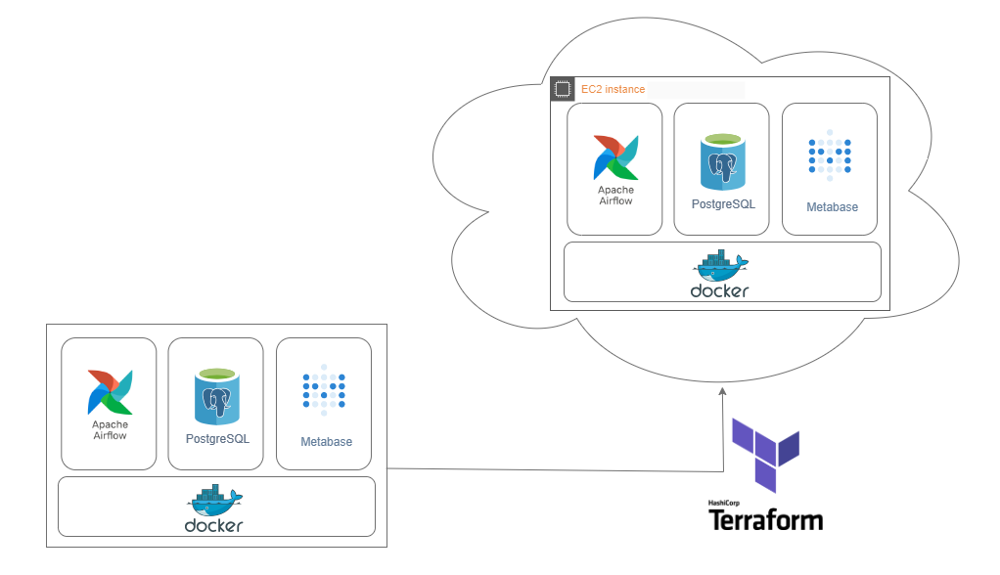

# CityBikes Data Dashboard

An ELT pipeline designed to fetch data from the [CityBikes API](https://api.citybik.es/v2/) and integrate it into an analytical dashboard.

## Architecture

A PostgreSQL database is used for both a data-lake and data-warehouse. While this approach may not align with conventional industry practices, it served as an educational exploration of some fundamental data engineering concepts.

All ETL scripts were written in Python + Pandas. Metabase was used for the dashboards. Airflow was originally used for scheduling but has been replaced by Cron due to resource constraints. (Both implementations are saved here, an Airflow instance simply needs to be spun up)
Docker was used to run all components in containers. 

## Infrastructure

An AWS ec2 instance is used to mimic a production environment. Terraform is used to store all the ec2 settings and allows us to quickly spool up a new instance or tear down existing ones. Github is used for version control and repository hosting. Github Actions is used to trigger CI/CD workflows.

